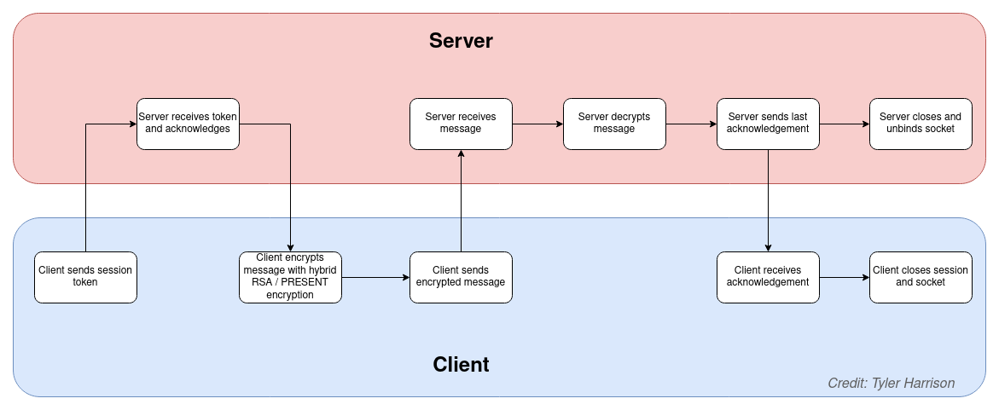

# Network Security Final

## Information

Folder structure

```bash
.
├── CSCI458-Project-PRESENT_Spring22.pdf
├── README.md
├── tcpclient.py
├── tcpserver.py
├── th_present.py
└── th_rsa.py

```

Description of each file:

- tcpclient / tcpserver - The TCP client and server
- th_rsa - My encryption functions for RSA
- th_present - My encryption functions for PRESENT


## Usage

Open 2 terminal windows. In one of them, run:

```bash
python3 tcpserver.py
```

and in the other run:

```bash
python3 tcpclient.py
```

## Data Flow

### Server

> A randomly generated integer is sent as the session key from the client to the server. This key is encrypted with a pre-shared public key and the server decrypts it with its private key. Once the session is authenticated, the server listens for a message. Only one message happens per session by default.

### Client

> Once the client has exchanged the session key with the server and received an acknowledgement, it will encrypt a message using a hybrid of RSA and PRESENT encryption.

### Diagram


